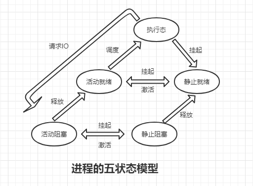

### 进程
1. 程序顺序执行的三个基本特征
    1. 顺序性
    2. 封闭性
    3. 可再现性
2. 进程的基本结构特征
    1. 进程控制块（PCB）
    2. 程序段
    3. 数据段
3. 进程的特性
    1. 动态性（最基本特征）是进程实体的一次执行过程，而程序是静态的
    2. 并发性 多个进程存在于内存中，并且能在一段时间内“同时”运行
    3. 独立性 在传统的OS（未引入线程之前）中，进程实体是一个独立运行，独立分配资源，独立接受调度的基本单位。
    4. 异步性 进程按照各自独立的、不可预知的速度向前推进
4. 进程的状态
    1. 就绪状态
        > 进程已分配到除处理机以外的所有资源，只要再获取处理马上就可以执行，此时进程处于就绪状态（Ready），通常保存在就绪队列里面
    2. 执行状态
        > 进程已获取处理机，程序正在执行
    3. 阻塞状态
        > 正在执行的进程由于某事件无法继续执行，便放弃处理机而处于暂停状态，执行受到了阻塞，通常保存在阻塞队列里面。
    4. 挂起状态
5. 进程的五状态模型

    
    
    >注释： 
    1. 阻塞态->就绪态：处于阻塞态的进程，使用激活原语（Active）激活后，进入就绪态
    2. 活动态->静止态：处于活动态的进程，使用挂起原语（SuSpend）挂起后，进入静止态
6. 进程的七状态模型

        